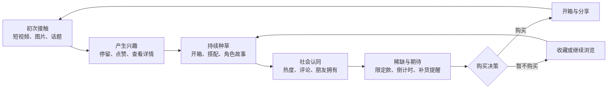

# Labubu 内容种草互动模拟网站

可以把它设计成一个“Labubu 内容种草 -> 兴趣增强 -> 社会认同 -> 购买决策”的互动模拟网站。重点不是直接卖货，而是让用户直观看到媒体内容如何逐步影响消费心理。

## 一、核心体验流程



## 二、网站页面架构

### 1. 首页：首页推荐流

模拟用户第一次接触 Labubu 内容的场景。

内容包括：

- Labubu 图片和短视频卡片
- “朋友刚刚点赞”“本周热门”等社交提示
- 点赞、收藏、分享、跳过按钮
- 用户兴趣值变化提示
- 当前模拟阶段

首页需要像社交媒体信息流，而不是传统商城。

### 2. 内容详情页：兴趣培养

点击内容后进入沉浸式详情页：

- Labubu 大图或短视频
- 角色背景故事
- 开箱内容
- 穿搭、桌面摆件或收藏展示
- 用户评论
- “查看同系列”按钮
- “我有点心动”互动按钮

这一页主要模拟“从注意到产生情感连接”。

### 3. 热度社区：社会认同

模拟社交媒体和收藏社区：

- 热门榜单
- 用户晒图
- 收藏人数
- KOL/KOC 推荐
- “朋友也喜欢”提示
- 不同款式的讨论热度
- 正面、犹豫和反对购买的评论

建议保留不同意见，避免让模拟变成单一的营销页面。

### 4. 收藏图鉴：投入感

让用户建立虚拟收藏：

- Labubu 系列图鉴
- 已发现、已收藏、未解锁状态
- 稀有度和角色信息
- 用户喜欢程度排序
- “加入愿望清单”
- 虚拟展示柜

用户投入的时间越多，购买意愿可能越高。这一部分可以体现“投入效应”。

### 5. 模拟商店：购买决策

不是一定要接入真实支付，可以先模拟购买过程：

- 商品列表
- 普通款、隐藏款、限定款
- 价格和库存
- 盲盒概率说明
- 配送与退货信息
- 购买、稍后决定、放弃购买
- 购买前理性提醒

理性提醒可以展示：

- 本月已模拟消费金额
- 是否因为倒计时而冲动购买
- 是否已经拥有相似款式
- 冷静 30 秒后再确认

### 6. 结算结果页：行为解释

用户完成或放弃购买后，生成一份个人报告：

- 浏览了多少条内容
- 哪类内容最能吸引用户
- 兴趣值变化曲线
- 哪个因素最终影响购买
- 从首次接触到购买用了多久
- 是否受到稀缺、从众或情感因素影响

示例结论：

> 你主要受到“开箱视频”和“限量库存”的影响。看到其他用户晒出隐藏款后，你的购买意愿从 42% 上升到了 78%。

### 7. 实验控制台

如果这个网站用于课程、研究或作品展示，可以增加实验模式：

- 调整内容出现频率
- 开启或关闭点赞数
- 调整评论倾向
- 开启或关闭限量提示
- 设置商品价格
- 设置用户初始兴趣
- 对比不同用户路径
- 导出匿名实验结果

## 三、界面布局

桌面端可采用三栏结构：

```text
┌─────────────────────────────────────────────┐
│ Logo   推荐   社区   图鉴   模拟商店   我的报告 │
├──────────┬─────────────────────┬────────────┤
│ 模拟阶段  │                     │ 兴趣仪表盘  │
│ 初次接触  │     内容推荐流       │ 兴趣值 68%  │
│ 兴趣形成  │                     │ 从众影响 42%│
│ 决策阶段  │                     │ 冲动程度 55%│
├──────────┴─────────────────────┴────────────┤
│       当前事件：某限定系列即将结束预订          │
└─────────────────────────────────────────────┘
```

移动端则保留底部五个导航：

- 推荐
- 社区
- 图鉴
- 商店
- 报告

## 四、核心数据结构

每位模拟用户可以记录：

```text
用户状态
├── 初始兴趣
├── 当前兴趣值
├── 价格敏感度
├── 社交影响敏感度
├── 稀缺信息敏感度
├── 已浏览内容
├── 点赞与收藏
├── 愿望清单
└── 最终购买决定
```

每条媒体内容包含：

```text
内容
├── 内容类型：短视频 / 图片 / 开箱 / 故事
├── 对兴趣值的影响
├── 情感强度
├── 社会认同强度
├── 商业宣传强度
├── 关联商品
└── 曝光与互动数据
```

## 五、技术架构建议

如果准备真正开发，可以采用：

- 前端：Next.js + React + Tailwind CSS
- 动画：Framer Motion
- 图表：Recharts
- 后端：Next.js API 或 Supabase
- 数据库：PostgreSQL
- 登录：Supabase Auth
- 媒体存储：Supabase Storage
- 部署：Vercel
- 数据分析：自建事件记录或 PostHog

系统模块可以分为：

```text
前端展示层
├── 内容推荐流
├── 社区与图鉴
├── 模拟商店
└── 行为报告

模拟引擎
├── 兴趣值计算
├── 推荐内容选择
├── 社会影响计算
├── 稀缺效应计算
└── 购买概率计算

数据层
├── 用户状态
├── 媒体内容
├── 商品数据
├── 行为事件
└── 实验配置
```

整体视觉上建议使用“潮玩收藏柜 + 社交媒体信息流”的结合：奶油白背景、黑色文字、少量粉红或荧光绿点缀。最好明确标注“行为模拟/媒体素养实验”，并把广告、库存和盲盒概率清晰展示，避免使用虚假倒计时或伪造购买记录。
